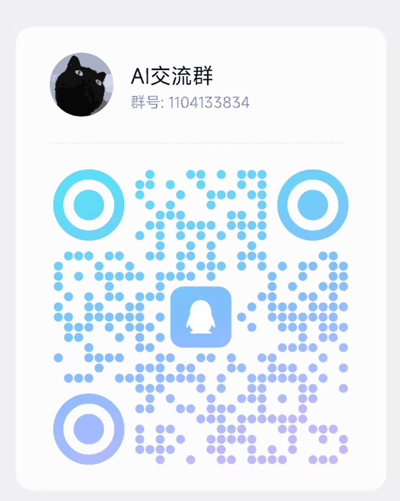
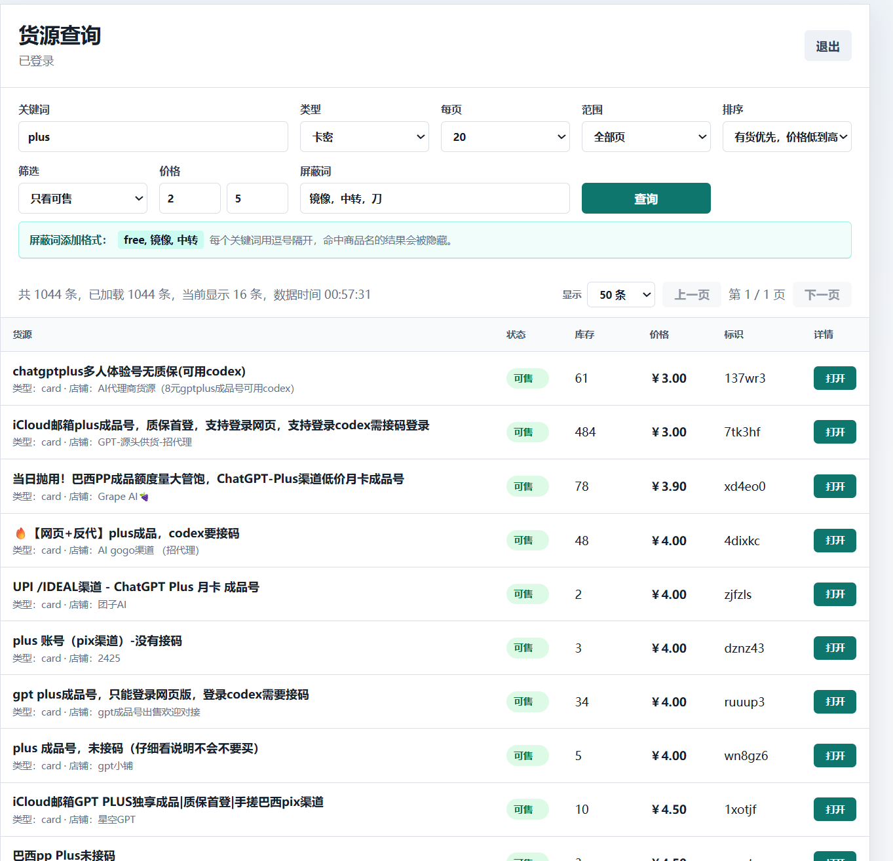

# source-browser

本地运行的货源查询工具，支持商家登录、货源搜索、可售筛选、价格排序和详情查看。

当前支持平台：

- 链动小店

暂不支持平台：

- 云猫寄售：当前网络与接口连通性不稳定，暂未作为可用平台发布。

## 交流QQ群

遇到问题或想交流使用经验，可以加入交流群：



## 预览



## 适用场景

这个工具适合已经开通链动小店商家账号的用户，用来在本地网页中更方便地查看货源：

- 按关键词搜索货源。
- 只看可售或已上架商品。
- 按价格范围筛选。
- 按可售优先、价格高低排序。
- 用屏蔽词隐藏不想看的商品。
- 打开货源详情链接。

## 使用前提

使用前需要先去链动小店注册商家账号，并开通小店。

注意：一定要注册商家账号并完成小店开通，否则登录后可能无法查看货源。

## 快速开始

安装 Node.js 后，在项目目录执行：

```bash
npm start
```

启动后访问：

```text
http://localhost:3000
```

项目默认连接的远端平台地址：

```text
链动小店：https://pay.ldxp.cn
```

如果需要切换远端地址，可以设置环境变量：

```bash
LDXP_BASE_URL=https://example.com npm start
```

Windows PowerShell 示例：

```powershell
$env:LDXP_BASE_URL="https://example.com"; npm start
```

## 使用方法

1. 打开 `http://localhost:3000`。
2. 使用链动小店商家账号登录。
3. 输入关键词，例如 `gpt`、`plus`。
4. 选择类型、查询范围、排序方式、价格范围和屏蔽词。
5. 点击查询，等待数据拉取完成后查看结果。

如果选择“全部页”，工具会拉取所有页数据。全部页拉取较慢，且只有全部拉取成功才会展示本次结果；如果远端某一页失败，本次查询会失败，不返回部分数据。

## 功能

- 商家账号登录。
- 本地保存登录态，重启服务后可继续使用。
- 不在前端页面暴露 `merchant_token`。
- 查询链动小店货源列表。
- 支持关键词、商品类型、每页数量和查询范围。
- 支持只看可售、已上架、全部商品。
- 支持价格范围筛选。
- 支持屏蔽词过滤，格式示例：`free, 镜像, 中转`。
- 支持按可售优先和价格高低排序。
- 支持打开货源详情链接。
- 支持查询进度显示和停止查询。

## 项目结构

```text
source-browser/
├─ public/
│  ├─ index.html
│  ├─ app.js
│  └─ styles.css
├─ docs/
│  └─ images/
├─ server.js
├─ package.json
├─ .gitignore
└─ README.md
```

## 隐私说明

本项目不会内置任何账号、密码、Cookie 或 Token。

登录态会保存在本机：

```text
data/sessions.json
```

该文件包含商家登录 token 和远端 Cookie，只用于本地保持登录状态。`data/` 已加入 `.gitignore`，不要提交到 Git 仓库，也不要打包发给别人。

开源或分享代码前，请确认不要包含以下内容：

- `data/` 目录
- `.env` 文件
- `*.zip` 打包文件
- `report*.md` 报告文件
- 任何包含账号、密码、Cookie、Token、用户名或真实店铺信息的截图

## 常见问题

### 登录后看不到货源

请确认账号是链动小店商家账号，并且已经完成小店开通。普通账号或未开通小店的账号可能无法查看货源。

### 全部页查询很慢

全部页需要逐页请求远端数据。货源数量越多，请求越慢。建议先用关键词、价格范围和屏蔽词缩小结果。

### 出现远端 HTTP 500

这通常表示远端平台接口临时异常或请求被远端拒绝。可以稍后重试，或减少查询范围后再查。

### 会保存我的账号密码吗

不会。项目只在本机保存登录态，不保存账号密码。

## 后续计划

- 评估更多货源平台支持。
- 优化筛选和排序体验。
- 增加更清晰的错误提示。
- 增加配置示例和部署说明。

## 免责声明

本项目仅供个人学习、研究和在合法授权范围内使用。

使用者需要自行确保自己的账号、接口访问、数据查看和使用方式符合对应平台规则及相关法律法规。因使用本项目产生的账号风险、平台限制、数据风险或其他损失，由使用者自行承担。

本项目不是任何平台的官方工具，也不隶属于相关平台。远端接口、登录规则、风控策略或页面结构发生变化时，本项目可能无法正常使用。
